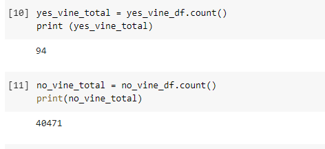
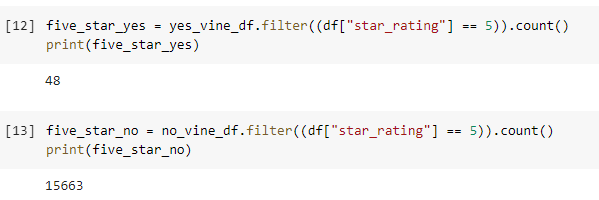
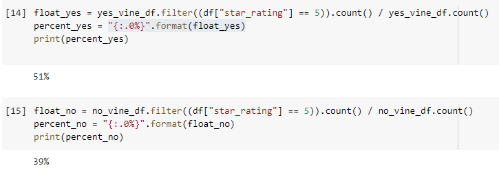

# Amazon_Vine_Analysis
## Overview of the analysis of the Vine program:
The Amazon Vine program is a paid program where members can access services/products from manufacturers and publishers. In return, Amazon Vine members are required to publish a review on the product.
We analyzed reviews on video games. With multiple consoles available, there is a plethora of reviews on video games to be worked on. We checked the reviews and saw how many of the reviews are Vine members and how many were not. We were able to also extract how many received five star reviews were given to the list of products.

## Results:
- How many Vine reviews and non-Vine reviews were there?
There were 94 Vine reviewers and 40,471 non Vine reviewers.

- How many Vine reviews were 5 stars? How many non-Vine reviews were 5 stars?
There were 48 five star Vine reviews and 15,663 five star non Vine reviews.

- What percentage of Vine reviews were 5 stars? What percentage of non-Vine reviews were 5 stars?
About 51% of the Vine reviews were five stars and 39% of the non Vine reviews were five stars.

## Summary:

I do not believe there is bias among the Vine/non Vine membership. Since video games are so borad with the genres and gameplay, it is rare that reviewers all prefer one type of game over another given the immense variety. 

We can try to determine if there is bias if we extracted data on one star reviews and see a significance of a smaller percentage of the reviews coming from Vine members.
